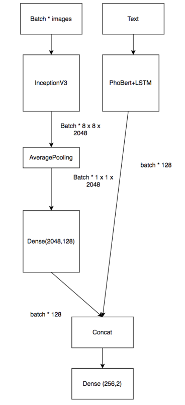

# Multimodal for comment sentiment analysis
This project is implementation for Bachelor's Thesis "Research on some methods to improve the reliability of comment sentiment analysis model"
## Implementation
### RSA-SM

[Stack-MaxMultimodal.ipynb](./Stack-MaxMultimodal.ipynb) 
### RSA-ALF
  
[Attetion-Multimodal-LateFusion.ipynb](./Attetion-Multimodal-LateFusion.ipynb)
### RSA-AEF
  
[Attetion-Multimodal-EarlyFusion.ipynb](./Attetion-Multimodal-EarlyFusion.ipynb)
### Voting-Multimodal
  
[VotingMultimodal-offficial.ipynb](./VotingMultimodal-offficial.ipynb)
### PhoBERT+LSTM
  
[PhoBERT_foody.ipynb](./PhoBERT_foody.ipynb)
### Attention-InceptionV3
  
[Inception-Attetion.ipynb](./Inception-Attetion.ipynb)
## Results AND Discussions
All details of model architectures and result experiments are reported in [Thesis-TanLeNghia-CN8.pdf](./Thesis-TanLeNghia-CN8.pdf)

